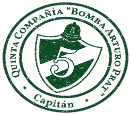

# Parte 5 CBS 🚒💚

## Agradecimientos 
+ José Fernández Bartholin
+ Vicente Barañao Abarzúa
+ Sergio Cortés Prado

# Resumen 🔰

Este codigo sirve para hacer más amena la pega de los ayudantes que tienen que hacer los partes de asistencia mensuales y trimestrales. 

# Explicación Código 🔧

Aqui un desglose de para que sirve cada archivo, y que se debe modificar en caso de:

## `main.py`

+ Desplega el menú principal.
+ Da las opciones a seleccioanr.
+ Inicializa la app.

### `monthly.py`

+ Generar planilla mensual.

### `quarterly.py`

+ Generar planilla trimestral.

### `gui.py`
+ Por rellenar

### `config.py`

+ Contiene el nombre del capitán.
+ Los actos obligatorios para voluntarios activos (no cambiar).
+ Los actos obligatorios para voluntarios honorarios (no cambiar).

# Utiles 🟦

## `firma.png` 💼

## `logo.png` 🟢

## `logocbs.png` 🟢🔵

## `stamp.png` 🟠

